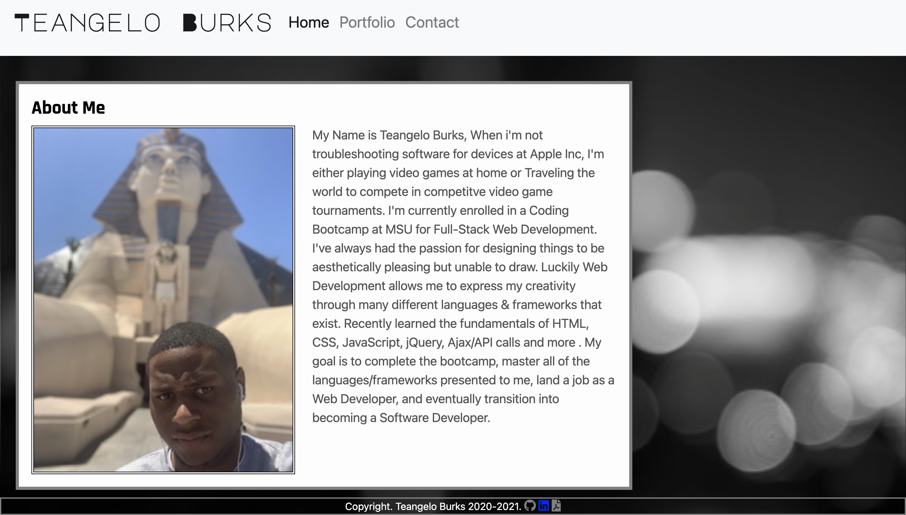
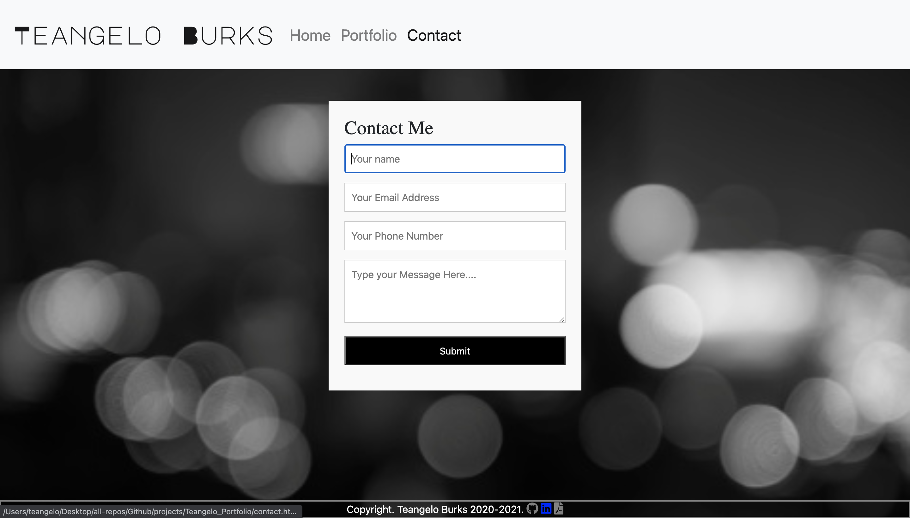

# Portfolio becomes Responsive!

Goal: Update Portfolio Page

## Developer: Teangelo Burks

**Tips for making my Portfolio Responsive:**
* When viewing my site on an xs screen my content takes up the entire page.
&nbsp;
* When viewing my site on a sm or larger screen, You'll notice that my content does not take up the entire screen. The reason for this is due to bootstrap's grid layout system using containers, rows, and columns.
&nbsp;

* While bootstrap does have an amazing grid layout system, Our good friend CSS comes in handy with adding padding/margins to help with getting our content properly aligned.
&nbsp;

*  Responsive Navigation Bar with all functioning links(Home, Portfolio, and Contact Page).

**Resources for help with creating my Portfolio**
[Bootstrap Grid Layout](https://getbootstrap.com/docs/5.0/forms/layout/#form-grid)
[W3 Schools Boostrap 3 Tutorial](https://www.w3schools.com/bootstrap/)
&nbsp;

### HTML & CSS Validator
Using a Validator system helps check your code for errors such as unclosed elements, missing qoutes, syntax errors, and more. 

**Here's the Validator's used for my code:**
* [freeformatter](https://www.freeformatter.com/html-validator.html)
 * [Validator W3](https://validator.w3.org)

 **Main Home Page**

 * **Links to Github, Linkedin, and Resume in the footer section**

**Contact Page.**

 **Technologies Used:**

 * HTML
 * CSS
 * Bootstrap
 * Font Awesome

**Here is the deployed URL:**
https://teangelo1.github.io/Teangelo-Portfolio/

**Links to: Github, and Linkedin account.**
&nbsp;

Github: https://github.com/Teangelo1
&nbsp;

LinkedIn: https://www.linkedin.com/in/teangelo-burks-9516a2164/
&nbsp;

>Stay Connected Guys